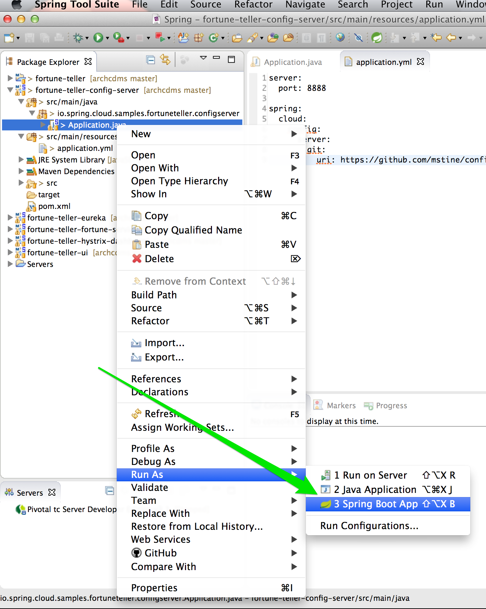

:compat-mode:
= Lab 3 - Composing Microservices with Spring Cloud and Netflix OSS

In this lab we're going to build a Fortune Teller application from two microservices, one that serves up random Chinese fortune cookie fortunes, and one that presents a user interface.
The resulting application looks like the following screenshot:

image::Common/images/fortunes-ui.png[width=50%]

We'll leverage libraries and services from Spring Cloud and Netflix OSS to help us compose the system.

== Bootstrapping

. Choose *File -> Import*:
+
image::Common/images/sts_import_1.png[width=50%]

. Choose *Maven -> Existing Maven Projects*:
+
image::Common/images/sts_import_2.png[width=50%]

. Choose the project's `pom.xml`, found at `$COURSE_HOME/labs/initial/fortune-teller` and click *Finish*.
+
image::Common/images/sts_import_3.png[width=50%]

== Config Server

First we'll create a Spring Cloud Config Server to distribute shared configuration across our distributed system.
This configuration will form the basis of how the entire system will compose.

. In the `fortune-teller-config-server` module, add a `@EnableConfigServer` annotation to the class `io.spring.cloud.samples.fortuneteller.configserver.Application`.

. Paste the following configuration properties into the file `src/main/resources/application.yml`:
+
----
server:
  port: 8888

spring:
  cloud:
    config:
      server:
        git:
          uri: https://github.com/mstine/config-repo.git
----
+
These properties tell the Config Server to listen on port `8888` and to source its configuration from the Git repository found at https://github.com/mstine/config-repo.

. Browse the file https://github.com/mstine/config-repo/blob/master/application.yml#L1-L18.
These lines tell all applications using the `cloud` Spring profile how to connect to and register themselves with Eureka.

. Right click on `io.spring.cloud.samples.fortuneteller.configserver.Application` and choose *Run As -> Spring Boot App*:
+

. Browse to http://localhost:8888/application/default.
You should see output similar to the following:
+
image::Common/images/config_server_output.png[width=50%]
+
Note that the response JSON defines a Spring `PropertySource` that contains Eureka configuration consistent with what you saw in the Git repository.

== Eureka Server

Next we'll create a Eureka service registry using Spring Cloud Netflix.
This server will act as the address book our UI application will use to locate the Fortune Service.

. In the `fortune-teller-eureka` module, add a `@EnableEurekaServer` annotation to the class `io.spring.cloud.samples.fortuneteller.eureka.Application`.

. Paste the following configuration properties into the file `src/main/resources/application.yml`:
+
----
server:
  port: 8761

eureka:
  instance:
    hostname: localhost
  client:
    registerWithEureka: false
    fetchRegistry: false
    serviceUrl:
      defaultZone: http://${eureka.instance.hostname}:${server.port}/eureka/
----
+
These properties tell the Eureka Server to listen on port `8761` and to configure itself in what is essentially ``standalone'' mode.

. As before, right click on `io.spring.cloud.samples.fortuneteller.eureka.Application` and choose *Run As -> Spring Boot App*.

. Browse to http://localhost:8761.
You should see a UI similar to the following:
+
image::Common/images/eureka_1.png[]

== Fortune Service

Now that our Spring Cloud/Netflix OSS infrastructure is bootstrapped, we'll begin development of our first microservice.
The Fortune Service will serve up a list of all fortune cookie fortunes present in its database or a single random fortune.

. In the `fortune-teller-fortune-service` module, create the package `io.spring.cloud.samples.fortuneteller.fortuneservice.domain`.

. Create a JPA domain class, `io.spring.cloud.samples.fortuneteller.fortuneservice.domain.Fortune`.
Into that class, paste the following code:
+
----
@Entity
@Table(name = "fortunes")
public class Fortune {

    @Id
    @GeneratedValue
    private Long id;

    @Column(nullable = false)
    private String text;

    public Long getId() {
        return id;
    }

    public void setId(Long id) {
        this.id = id;
    }

    public String getText() {
        return text;
    }

    public void setText(String text) {
        this.text = text;
    }
}
----
+
Add the appropriate imports using the IDE's quick fix feature.
+
This class represents the domain model for a fortune, having an unique identifier and the fortune's text.

. Next, create the package `io.spring.cloud.samples.fortuneteller.fortuneservice.repositories`.

. Create a Spring Data JPA repository interface, `io.spring.cloud.samples.fortuneteller.fortuneservice.repositories.FortuneRepository`.
Into that class, paste the following code:
+
----
public interface FortuneRepository extends PagingAndSortingRepository<Fortune, Long> {

    @Query("select fortune from Fortune fortune order by RAND()")
    public List<Fortune> randomFortunes(Pageable pageable);
}
----
+
Add the appropriate imports using the IDE's quick fix feature.
+
This interface will provide all of the basic boilerplate CRUD features we'll want for our `Fortune` domain class.
The `@Query` annotation defines a SQL statement that will return a random ordering of the fortunes.
We'll use this as the basis of returning a random fortune via our REST interface.

. Next, create the package `io.spring.cloud.samples.fortuneteller.fortuneservice.controllers`.

. Create a Spring MVC Controller class, `io.spring.cloud.samples.fortuneteller.fortuneservice.controllers.FortuneController`.
Into that class, paste the following code:
+
----
@RestController
public class FortuneController {

    @Autowired
    FortuneRepository repository;

    @RequestMapping("/fortunes")
    public Iterable<Fortune> fortunes() {
        return repository.findAll();
    }

    @RequestMapping("/random")
    public Fortune randomFortune() {
        List<Fortune> randomFortunes = repository.randomFortunes(new PageRequest(0, 1));
        return randomFortunes.get(0);
    }
}
----
+
Add the appropriate imports using the IDE's quick fix feature.
+
This class provides the two REST endpoints of our microservice.
The `randomFortune` method provides a `PageRequest` to limit the returned results to one.

. Add `@EnableJpaRepositories` (to enable the Spring Data JPA repository we created) and `@EnableDiscoveryClient` (to switch on Eureka registration) annotations to `io.spring.cloud.samples.fortuneteller.fortuneservice.Application`.

. Paste the following configuration properties into the file `src/main/resources/bootstrap.yml`:
+
----
spring:
  application:
    name: fortunes
----
+
This configuration specifies the name of the application, which will be used to register the service in Eureka.
It also tells the service how to locate the config server.

. Paste the following configuration properties into the file `src/main/resources/application.yml`:
+
----
spring:
  jpa:
    hibernate:
      ddl-auto: create-drop

---

spring:
  profiles: default
  jpa:
    database: HSQL

---

spring:
  profiles: cloud
  jpa:
    database: MYSQL
----
+
This configuration specifies the model to DDL setting to be used by Hibernate, as well as the Hibernate dialects to be used for local development and cloud.

. As before, right click on `io.spring.cloud.samples.fortuneteller.fortuneservice.Application` and choose *Run As -> Spring Boot App*.

. After the service has been running for ten seconds, refresh your Eureka browser tab.
You should see a registration entry for the fortune service.

. Visit http://localhost:8080/random. You should see output similar to the following:
+
image::Common/images/fortune_service_output.png[]

== Fortune UI

Now that our Fortune microservice is running, we'll begin development of our second microservice.
The Fortune UI will serve up a AngularJS single page application that consumes the fortune service.

. In the `fortune-teller-ui` module, create the package `io.spring.cloud.samples.fortuneteller.ui.service.fortunes`.
This package will contain our integration with the fortune service.

. Create the POJO `io.spring.cloud.samples.fortuneteller.ui.services.fortunes.Fortune`.
Into that class, paste the following code:
+
----
public class Fortune {
    private Long id;
    private String text;

    public Fortune() {
    }

    public Fortune(Long id, String text) {
        this.id = id;
        this.text = text;
    }

    public Long getId() {
        return id;
    }

    public void setId(Long id) {
        this.id = id;
    }

    public String getText() {
        return text;
    }

    public void setText(String text) {
        this.text = text;
    }
}
----
+
We will use this class to unmarshal the response from the fortune service.

. Create the Spring Bean `io.spring.cloud.samples.fortuneteller.ui.services.fortunes.FortuneService`.
Into that class, paste the following code:
+
----
@Service
public class FortuneService {

    @Autowired
    RestTemplate restTemplate;

    @HystrixCommand(fallbackMethod = "fallbackFortune")
    public Fortune randomFortune() {
        return restTemplate.getForObject("http://fortunes/random", Fortune.class);
    }

    private Fortune fallbackFortune() {
        return new Fortune(42L, "Your future is unclear.");
    }
}
----
+
Add the appropriate imports using the IDE's quick fix feature.
+
This class is our integration point with the fortune service.
It uses a special `RestTemplate` bean that integrates with Ribbon from Netflix OSS.
The argument passed to `getForObject`, `http://fortunes/random`, will be resolved by Ribbon to the actual address of the fortune service.
This method is also protected by a Hystrix circuit breaker using the `@HystrixCommand` annotation.
If the circuit is tripped to open (due to an unhealthy fortune service), the `fallbackFortune` method will return a dummy response.

. Next, create the package `io.spring.cloud.samples.fortuneteller.ui.controllers`.

. Create a Spring MVC Controller class, `io.spring.cloud.samples.fortuneteller.ui.controllers.UiController`.
Into that class, paste the following code:
+
----
@RestController
public class UiController {

    @Autowired
    FortuneService service;

    @RequestMapping("/random")
    public Fortune randomFortune() {
        return service.randomFortune();
    }
}
----
+
Add the appropriate imports using the IDE's quick fix feature.
+
This class provides the REST endpoint that will be consumed by our AngularJS UI.

. Add `@EnableCircuitBreaker` (to switch on Hystrix circuit breakers) and `@EnableDiscoveryClient` (to switch on Eureka registration) annotations to `io.spring.cloud.samples.fortuneteller.ui.Application`.

. Paste the following configuration properties into the file `src/main/resources/bootstrap.yml`:
+
----
spring:
  application:
    name: ui  
----
+
This configuration specifies the name of the application, which will be used to register the service in Eureka.
It also tells the service how to locate the config server.

. Paste the following configuration properties into the file `src/main/resources/application.yml`:
+
----
server:
  port: 8081

eureka:
  client:
    registryFetchIntervalSeconds: 5

fortunes:
  ribbon:
    ServerListRefreshInterval: 5000
----
+
This configuration instructs the application to listen on port 8081.
It also provides low cache refresh settings for the Eureka client and Ribbon to make the demo more responsive.

. As before, right click on `io.spring.cloud.samples.fortuneteller.ui.Application` and choose *Run As -> Spring Boot App*.

. After the service has been running for ten seconds, refresh your Eureka browser tab.
You should see a registration entry for the Fortune UI.

. Visit http://localhost:8081. You should see output similar to the following:
+
image::Common/images/fortunes-ui.png[width=50%]

== Hystrix Dashboard

Finally, we'll add one more piece of infrastructure -- a dashboard that allows us to monitor our circuit breakers -- using Spring Cloud Netflix.

. In the `fortune-teller-hystrix-dashboard` module, add `@EnableHystrixDashboard` and `@Controller` annotations to the class `io.spring.cloud.samples.fortuneteller.hystrixdashboard.Application`.

. Add the following request handler method to `io.spring.cloud.samples.fortuneteller.hystrixdashboard.Application`:
+
----
@RequestMapping("/")
public String home() {
    return "forward:/hystrix";
}
----
+
Add the appropriate imports using the IDE's quick fix feature.
+
This request handler will allow us to hit the default endpoint our application to interact with the Hystrix Dashboard.

. Paste the following configuration properties into the file `src/main/resources/application.yml`:
+
----
server:
  port: 7979
----
+
This configuration instructs the application to listen on port `7979`.

. As before, right click on `io.spring.cloud.samples.fortuneteller.hystrixdashboard.Application` and choose *Run As -> Spring Boot App*.

. Visit http://localhost:7979.
You should see output similar to the following:
+
image::Common/images/hystrix_dashboard_1.png[width=50%]

. Paste http://localhost:8081/hystrix.stream into the text field and click *Monitor Stream*.
You should see output similar to the following:
+
image::Common/images/hystrix_dashboard_2.png[width=50%]
